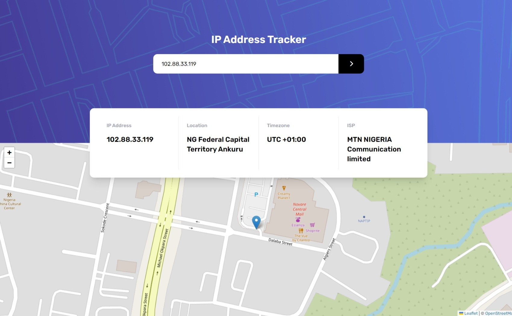

# Frontend Mentor - IP address tracker solution

This is a solution to the [IP address tracker challenge on Frontend Mentor](https://www.frontendmentor.io/challenges/ip-address-tracker-I8-0yYAH0). Frontend Mentor challenges help you improve your coding skills by building realistic projects. 

## Table of contents

- [Overview](#overview)
  - [The challenge](#the-challenge)
  - [Screenshot](#screenshot)
  - [Links](#links)
- [Author](#author)

## Overview

### The challenge

Users should be able to:

- See their own IP address on the map on the initial page load
- Search for any IP addresses and see the key information and location

### Screenshot

### Links

- Solution URL: [Add solution URL here](https://your-solution-url.com)
- Live Site URL: [Add live site URL here](https://your-live-site-url.com)

### Built with

- Semantic HTML5 markup
- [Tailwind CSS](https://tailwindcss.com/) - Tailwind CSS
- JavaScript

## Author

- GitHub - [Michael Ilesanmi](https://github.com/Michael-Ilesanmi)
- Twitter - [@__localdev](https://twitter.com/__localdev)

